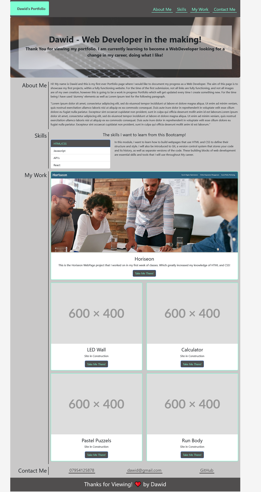

# Unit 3 Challenge: Code Bootstrap Portfolio

## Table of Contents:
For the ease of navigating around:

* [The Task](#the-task)
* [Previous Example](#previous-example)
* [End result](#end-result)
* [Conclusion](#conclusion)
* [Deployment](#deployment)
* [License](#license)

## The Task:

In this assignment, I was tasked with rebuilding my previous portfolio website layout using the Bootstrap CSS Framework, with the following items:

   The website should include the following bootstrap components:

    - A Navigation bar:
    
    - A navigation menu at the top. Feel free to use bootstrap's navbar or create your own.

      - Include links that are applicable to your portfolio.
  
        - Links should navigate to the appropriate sections 

    - A hero section:

        - A jumbotron featuring your picture, your name, and any other information you'd like to include.

    - A work section:

      - A section displaying your work in grid. 

      - Use bootstrap cards for each project.

        - The description should give a brief overview of the work.

    - A skills section:

      - List out the skills you expect to learn from the bootcamp.

    - An about / contact section.

    - A footer section.

    - All hyperlinks should have a hover effect.

    - All buttons should display a box shadow upon hover.
    
    - Bootstrap solution should minimize use of media queries.
    
    - Deploy your new Bootstrap-powered portfolio to GitHub Pages.

**Side Note:** As per the challenge readme file, I did not have enough web applications to showcase at the moment. Thus currently I have only linked my 'Horiseon' web page, but have prepped space for future additions using dummy links and photos, thus everythins is prepared for when I do have the applications.

## Previous Example:

This was my previous portfolio Website created using only HTML and CSS with no Bootstrap elements, shown for comparison: 'https://davvid96.github.io/Dawid-Portfolio-Page/'

## End result:

This is a screenshot of what my portfolio website looks like at the time of submitting:

## Conclusion:
This Portfolio was created with the intent to showcase my work in the future, by all means with a set of guidelines outlined prior to starting which made it a lot more interesting as I got to practice my newly gained skills and knowledge. A very fun and educational activity, which naturally boosted my skills as well as confidence. Which will hopefully come useful in the future challenges to come! I can also already see number of points that could be corrected or improved, however will leave the page as it is and await feedback on what could be improved.

## Deployment:

* Following is a link to the deployed version of the Website: 'https://davvid96.github.io/Dawid-Portfolio-Page/'

## License:

***MIT License*** has been used for the purpose of this challenge. File located in the Repository.